# Site Portfólio

Projeto de desafio do curso "Praticando Front End: Challenge Portfólio" para o programa ONE - Oracle Next Education em parceria com a Alura.

O projeto pode ser testado pelo link: <https://rafaelmaia23.github.io/portfolio-website/>

O site conta com layout responsivo para pc, tablet e smartphone.

## Versão Pc

   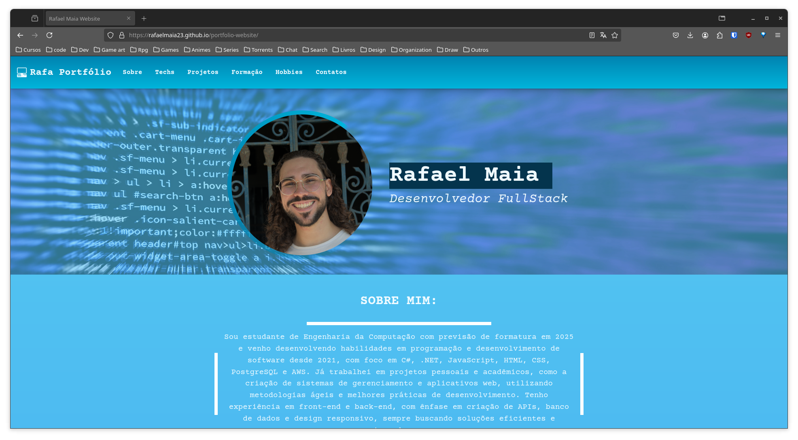
   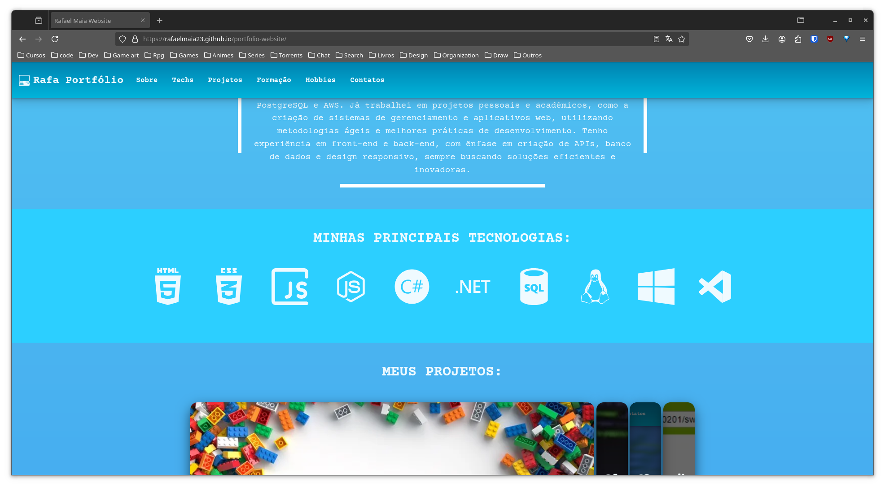
   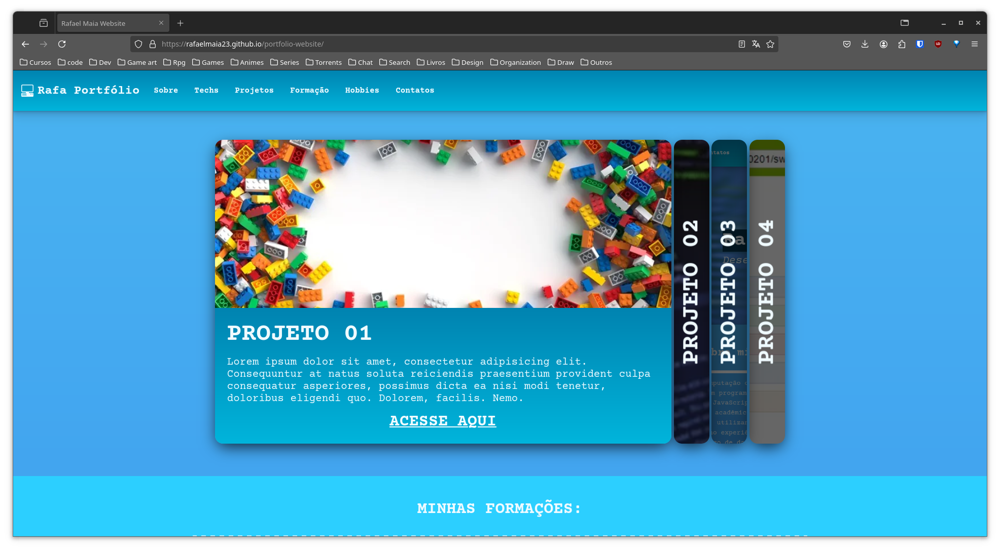
   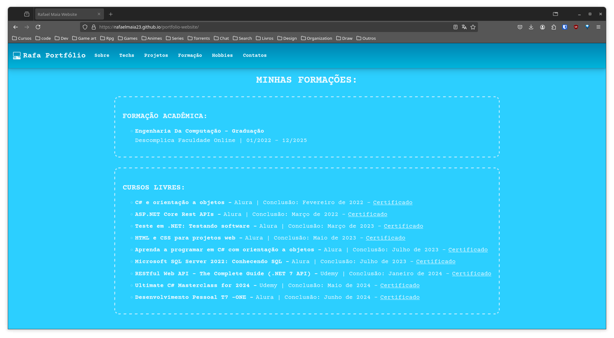
   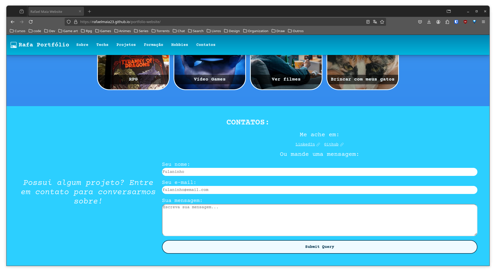

## Versão Tablet

    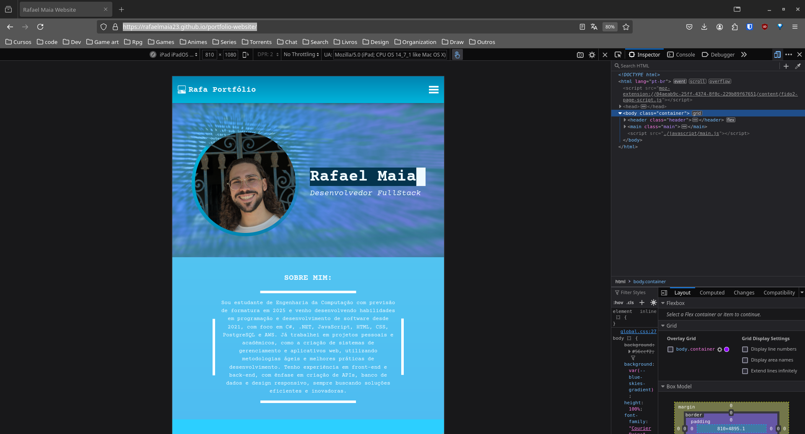
    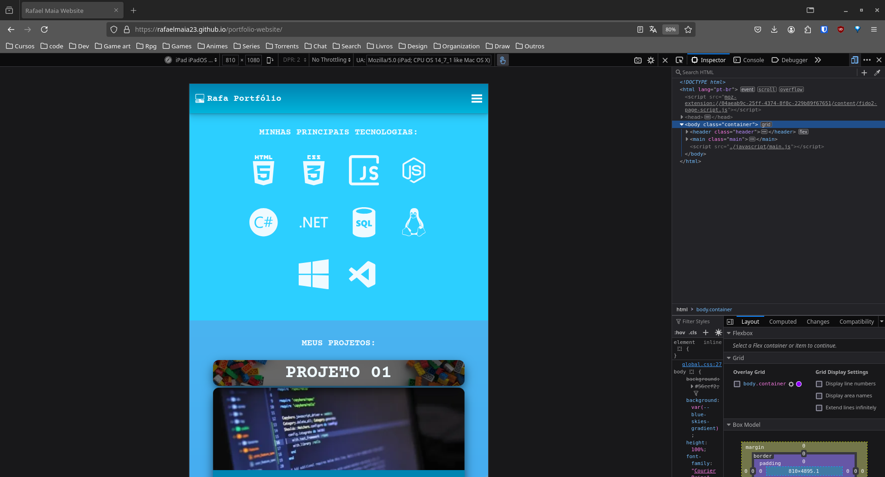
    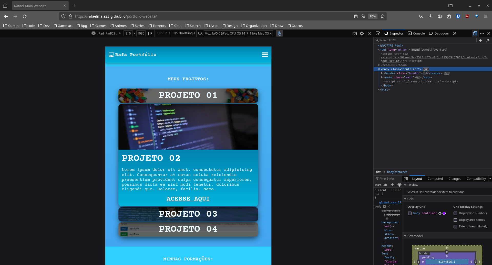
    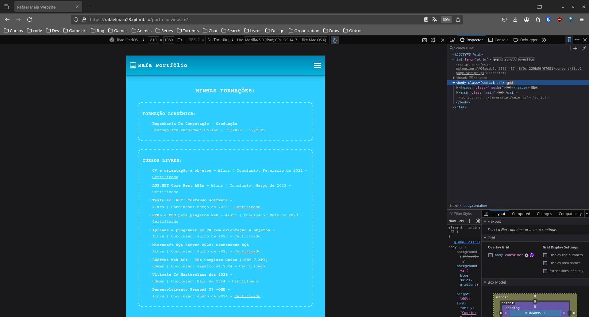
    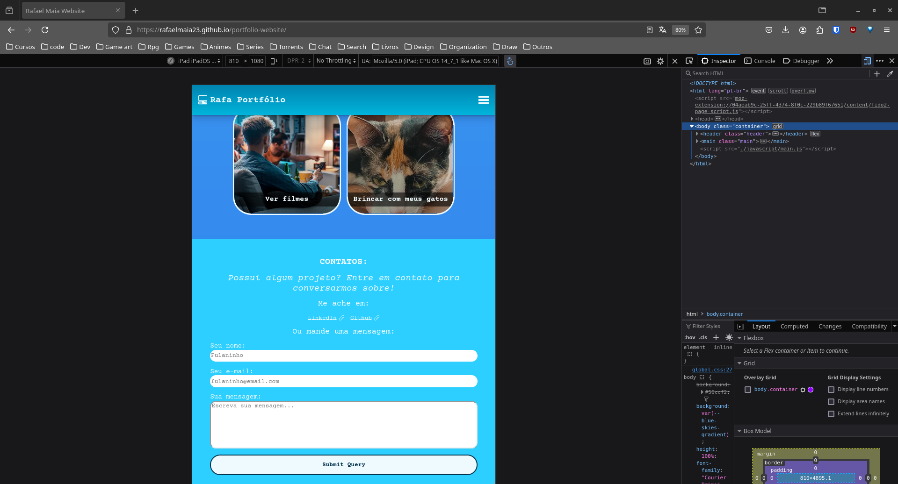
    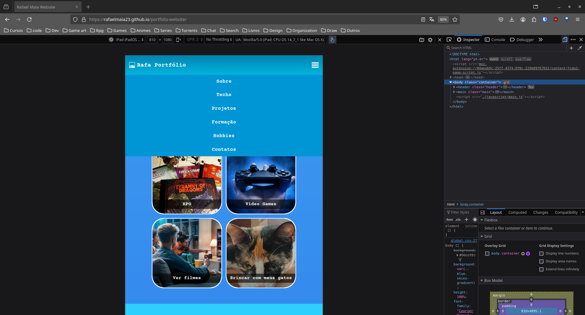

## Versão Smartphone

   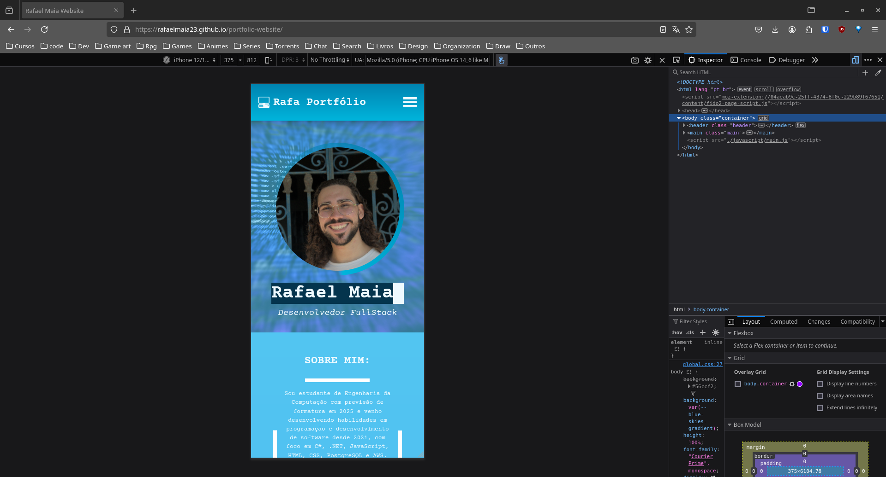
   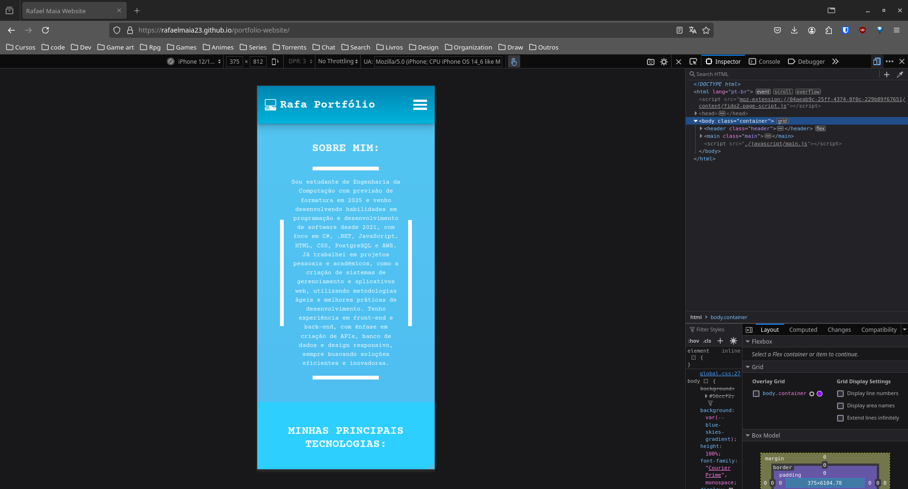
   
   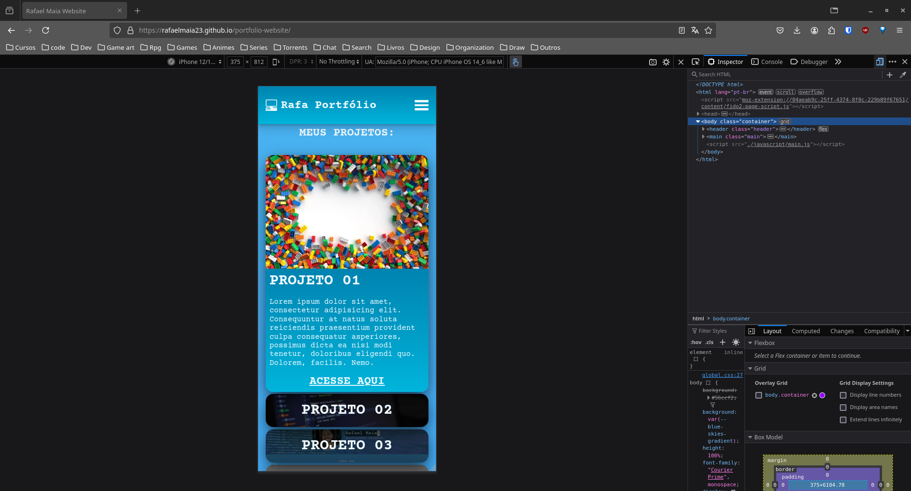
   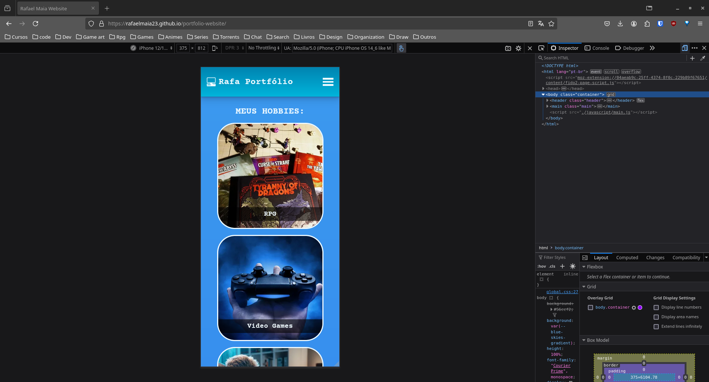
   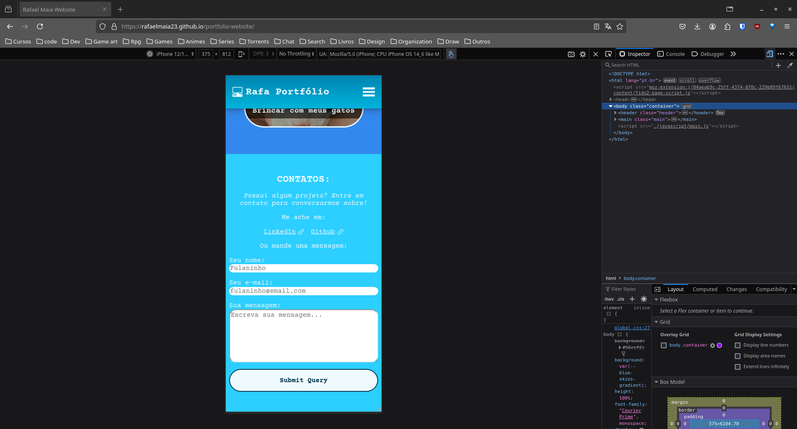
   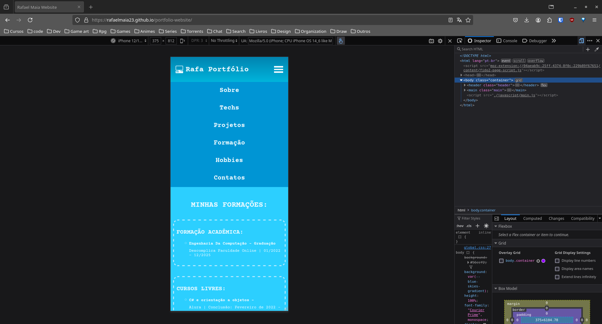

 

 

### Projeto criado por Rafael Maia

GitHub: <https://github.com/rafaelmaia23>

LinkedIn: <https://www.linkedin.com/in/rafaelmaiadafonseca/>
